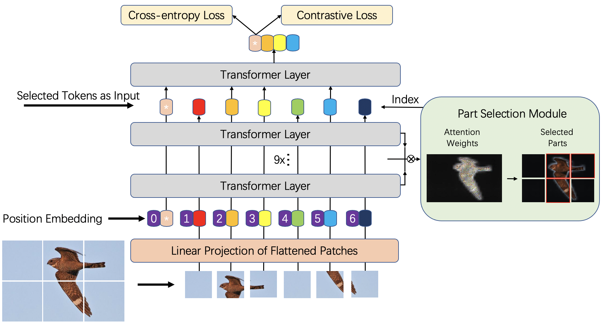

# TransFG: A Transformer Architecture for Fine-grained Recognition

[](https://paperswithcode.com/sota/fine-grained-image-classification-on-cub-200?p=transfg-a-transformer-architecture-for-fine) [](https://paperswithcode.com/sota/fine-grained-image-classification-on-nabirds?p=transfg-a-transformer-architecture-for-fine) [](https://paperswithcode.com/sota/fine-grained-image-classification-on-stanford-1?p=transfg-a-transformer-architecture-for-fine) [](https://paperswithcode.com/sota/image-classification-on-inaturalist?p=transfg-a-transformer-architecture-for-fine)

Official PyTorch code for the paper:  [*TransFG: A Transformer Architecture for Fine-grained Recognition (AAAI2022)*](https://arxiv.org/abs/2103.07976)  


## Framework



## Dependencies:
+ Python 3.7.3
+ PyTorch 1.5.1
+ torchvision 0.6.1
+ ml_collections

## Usage
### 1. Download Google pre-trained ViT models

* [Get models in this link](https://console.cloud.google.com/storage/vit_models/): ViT-B_16, ViT-B_32...
```bash
wget https://storage.googleapis.com/vit_models/imagenet21k/{MODEL_NAME}.npz
```

### 2. Prepare data

In the paper, we use data from 5 publicly available datasets:

+ [CUB-200-2011](http://www.vision.caltech.edu/visipedia/CUB-200-2011.html)
+ [Stanford Cars](https://ai.stanford.edu/~jkrause/cars/car_dataset.html)
+ [Stanford Dogs](http://vision.stanford.edu/aditya86/ImageNetDogs/)
+ [NABirds](http://dl.allaboutbirds.org/nabirds)
+ [iNaturalist 2017](https://github.com/visipedia/inat_comp/tree/master/2017)

Please download them from the official websites and put them in the corresponding folders.

### 3. Install required packages

Install dependencies with the following command:

```bash
pip3 install -r requirements.txt
```

### 4. Train

To train TransFG on CUB-200-2011 dataset with 4 gpus in FP-16 mode for 10000 steps run:

```bash
CUDA_VISIBLE_DEVICES=0,1,2,3 python3 -m torch.distributed.launch --nproc_per_node=4 train.py --dataset CUB_200_2011 --split overlap --num_steps 10000 --fp16 --name sample_run
```

## Citation

If you find our work helpful in your research, please cite it as:

```
@article{he2021transfg,
  title={TransFG: A Transformer Architecture for Fine-grained Recognition},
  author={He, Ju and Chen, Jie-Neng and Liu, Shuai and Kortylewski, Adam and Yang, Cheng and Bai, Yutong and Wang, Changhu and Yuille, Alan},
  journal={arXiv preprint arXiv:2103.07976},
  year={2021}
}
```

## Acknowledgement

Many thanks to [ViT-pytorch](https://github.com/jeonsworld/ViT-pytorch) for the PyTorch reimplementation of [An Image is Worth 16x16 Words: Transformers for Image Recognition at Scale](https://arxiv.org/abs/2010.11929)

